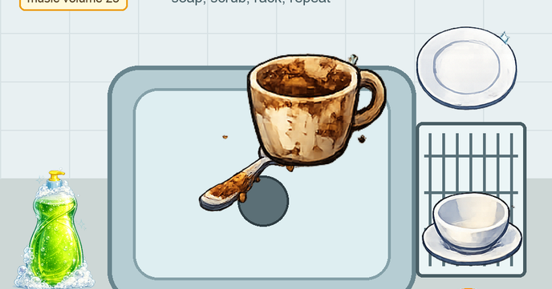

# dishwasher-sim

Find the project online at [projects.raspberrypi.org/en/projects/dishwasher-sim](https://projects.raspberrypi.org/en/projects/dishwasher-sim)

## Resources
For project materials and solutions, see [en/resources](https://github.com/raspberrypilearning/dishwasher-sim/tree/master/en/resources) and [en/solutions](https://github.com/raspberrypilearning/dishwasher-sim/tree/master/en/solutions).

## Contributing
See [CONTRIBUTING.md](CONTRIBUTING.md)

## Licence
See [LICENCE.md](LICENCE.md)

## Setting up a Crowdin project

See [CROWDIN.md](CROWDIN.md).
