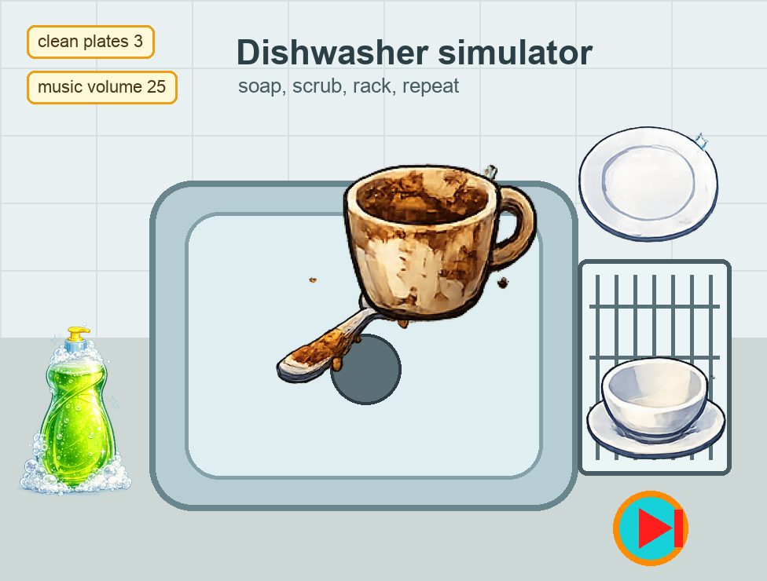
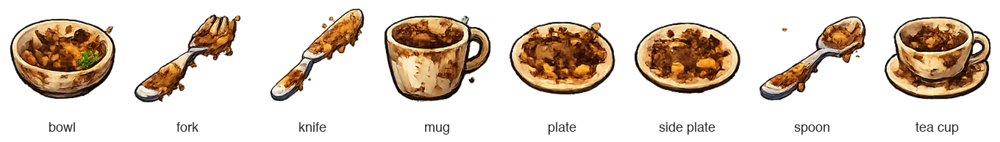

## What you will make

You're going to build a **cosy dishwasher simulator**. The player adds soap, scrubs a dirty dish until it sparkles, then drags it into the rack before the next dirty dish appears.

> [!TIP]
>
> A **cosy game** is designed to feel calm, welcoming, and satisfying rather than stressful or competitive.

> [!NOPRINT]
>
> 

>  <iframe allowtransparency="true" width="485" height="402" src="https://scratch.mit.edu/projects/embed/1362381726/?autostart=false" frameborder="0"></iframe>
> 

> [!PRINTONLY]
>
> 

You will start with a Scratch project that already has the sprites, costumes, and sounds. You will create the variables and the list as you build the code.

### You will need:

- The Scratch editor
- The [Dishwasher simulator starter](https://scratch.mit.edu/projects/1362382639/editor){:target="_blank"} project
