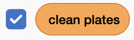
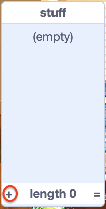
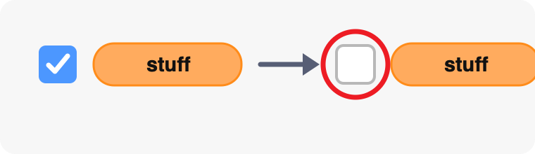
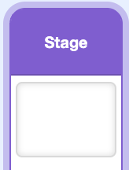
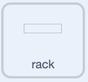

## Start the dishwasher

Set up the game state, place the rack, and make the cloth follow the mouse pointer.

> [!TASK]
>
> Open the [Dishwasher simulator starter](https://scratch.mit.edu/projects/1362382639/editor){:target="_blank"}. It already has the sprites, costumes, and sounds you need.

> [!TASK]
>
> Open the `Variables`{:class="block3variables"} blocks menu. Make these variables **for all sprites**:
>
> - `clean plates`{:class="block3variables"} — this stores the player's score. Leave this variable ticked so it appears on the Stage.
> - `clean`{:class="block3variables"} — this stores a Boolean value that says whether the current dish is clean. **Untick this variable.**
> - `soap`{:class="block3variables"} — this stores a Boolean value that says whether the player has picked up soap. **Untick this variable.**
>
> Make sure the only variable still ticked is `clean plates`{:class="block3variables"}:
> <p align="center"></p>

> [!TASK]
>
> Keep the Stage selected. Choose **Make a List** from the `Variables`{:class="block3variables"} blocks menu and make a list called `stuff`{:class="block3variables"} **for all sprites**.
>
> Add `bowl` as the first item in the list. You will add the other dishes later.
>
> 
>
> Untick the checkbox next to `stuff`{:class="block3variables"} so that the list does not appear on the Stage.
>
> 

> [!TASK]
>
> Add the script below to the Stage to reset the game. In this project, the `clean`{:class="block3variables"} and `soap`{:class="block3variables"} variables only store `true` or `false`, so initialise both with the Boolean value `false`.
>
> From the menu in the `broadcast ()`{:class="block3events"} block, choose **New message**. Name the new broadcast `bowl`.
>
> 
>
> ```blocks3
> +when green flag clicked
> +set [clean plates v] to (0)
> +set [clean v] to [false]
> +set [soap v] to [false]
> +broadcast (bowl v)
> ```

> [!TIP]
>
> To **initialise** a variable means to give it a starting value. Here, the game starts with a score of `0`, and `clean` and `soap` set to `false`.

> [!TASK]
>
> Replace `bowl` in the `broadcast ()`{:class="block3events"} block with blocks that select a random item from `stuff`{:class="block3variables"}.
>
> There is only one item in the list for now, so this script will always broadcast `bowl`. When you add more items later, the same code will choose between them.
>
> 
>
> ```blocks3
> when green flag clicked
> set [clean plates v] to (0)
> set [clean v] to [false]
> set [soap v] to [false]
> +broadcast (item (pick random (1) to (length of [stuff v])) of [stuff v])
> ```

> [!TASK]
>
> Select the `rack` sprite in the Sprite pane. It will be the target for clean dishes. Use a `when green flag clicked`{:class="block3events"} block to put it in the right place.
>
> The `rack` sprite is just a collision box. It looks plain because the drying rack the player sees is already drawn on the backdrop.
>
> 
>
> ```blocks3
> +when green flag clicked
> +go to x: (140) y: (-38)
> ```

> [!TIP]
>
> In games, two sprites **collide** when they are touching. Later, a `touching ()?`{:class="block3sensing"} block will detect when a clean dish collides with the rack.

> [!TASK]
>
> Select the `cloth` sprite in the Sprite pane. Add this script to make the cloth follow the mouse pointer and stay in front of the other sprites.
>
> 
>
> ```blocks3
> +when green flag clicked
> +forever
> +go to (mouse-pointer v)
> +go to [front v] layer
> end
> ```

> [!TASK]
>
> <p align="center"></p>
>
> Click the green flag, then move the mouse pointer around the Stage. The cloth should follow it.
