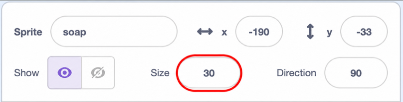

## Add soap and a cloth

Make the soap clickable and change the cloth to show the state of the game.

> [!TASK]
>
> Select the `soap` sprite in the Sprite pane. Add code so the player can use the soap before they scrub a dish.
>
> <p align="center"></p>
>
> ```blocks3
> +when this sprite clicked
> +start sound (Bubbles v)
> +set [soap v] to [true]
> ```

> [!TASK]
>
> Add another script to the `soap` sprite to make it sit behind the dishes.
>
> <p align="center"></p>
>
> ```blocks3
> +when green flag clicked
> +set drag mode [not draggable v]
> +go to [back v] layer
> ```

> [!TASK]
>
> Start one more script on the `soap` sprite. Set its size to `30` percent before adding any blocks that change its size. This known starting size makes it easy to reset the soap if you make a mistake.
>
> Add a `forever`{:class="block3control"} loop beneath the size block.
>
> <p align="center"></p>
>
> ```blocks3
> +when green flag clicked
> +set size to (30) %
> +forever
> end
> ```

> [!TIP]
>
> `30` percent is the preset starting size for the soap. You can experiment by changing the value in the `set size to () %`{:class="block3looks"} block, and return it to `30` if you want to reset it.
>
> 

> [!TASK]
>
> Inside the `forever`{:class="block3control"} loop, add a `repeat ()`{:class="block3control"} loop that gradually makes the soap larger.
>
> <p align="center"></p>
>
> ```blocks3
> when green flag clicked
> set size to (30) %
> forever
> +repeat (15)
> +change size by (0.2)
> end
> end
> ```

> [!TASK]
>
> Beneath the first `repeat ()`{:class="block3control"} loop, add another loop that returns the soap to `30` percent.
>
> <p align="center"></p>
>
> ```blocks3
> when green flag clicked
> set size to (30) %
> forever
> repeat (15)
> change size by (0.2)
> end
> +repeat (15)
> +change size by (-0.2)
> end
> end
> ```

> [!TASK]
>
> Select the `cloth1` sprite in the Sprite pane. Add another script that starts by showing the dry cloth.
>
> <p align="center"></p>
>
> ```blocks3
> +when green flag clicked
> +forever
> +switch costume to (cloth1 v)
> end
> ```

> [!TASK]
>
> Replace the `switch costume to (cloth1 v)`{:class="block3looks"} block with an `if () then else`{:class="block3control"} block. Keep the dry cloth in the `else`{:class="block3control"} branch.
>
> <p align="center"></p>
>
> ```blocks3
> when green flag clicked
> forever
> +if <(clean) = [true]> then
> else
> switch costume to (cloth1 v)
> end
> end
> ```

> [!TASK]
>
> Add a `switch costume to ()`{:class="block3looks"} block inside the first branch to show the hand when the dish is clean.
>
> <p align="center"></p>
>
> ```blocks3
> when green flag clicked
> forever
> if <(clean) = [true]> then
> +switch costume to (hand v)
> else
> switch costume to (cloth1 v)
> end
> end
> ```

> [!TASK]
>
> Inside the `else`{:class="block3control"}, add another `if () then else`{:class="block3control"} block to check whether the player has picked up soap. Keep the dry cloth in the new `else`{:class="block3control"} branch.
>
> <p align="center"></p>
>
> ```blocks3
> when green flag clicked
> forever
> if <(clean) = [true]> then
> switch costume to (hand v)
> else
> +if <(soap) = [true]> then
> else
> switch costume to (cloth1 v)
> end
> end
> end
> ```

> [!TASK]
>
> Add a `switch costume to ()`{:class="block3looks"} block inside the soap branch to show the soapy cloth.
>
> <p align="center"></p>
>
> ```blocks3
> when green flag clicked
> forever
> if <(clean) = [true]> then
> switch costume to (hand v)
> else
> if <(soap) = [true]> then
> +switch costume to (cloth2 v)
> else
> switch costume to (cloth1 v)
> end
> end
> end
> ```

> [!TASK]
>
> <p align="center"></p>
>
> Click the green flag, then click the soap on the Stage. The soap should pulse gently, and the cloth should change to the soapy costume.

> [!TIP]
>
> **Visual feedback** shows the player that an action worked. Changing the cloth costume makes it clear when the player has picked up soap.
