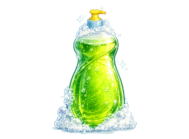
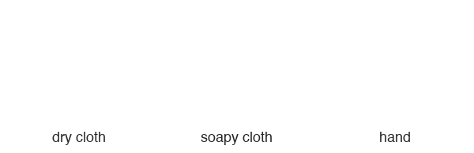

## Add soap and a cloth

Make the soap clickable and make the cloth follow the pointer.

> [!TASK]
>
> Click the `soap` sprite. Add code so the player can click the soap before they scrub a dish.
>
> <p align="center"></p>
>
> ```blocks3
> when this sprite clicked
> start sound (Bubbles v)
> set [soap v] to [true]
> ```

> [!TASK]
>
> Add another script to the `soap` sprite to make it sit behind the dishes and pulse gently.
>
> ```blocks3
> when green flag clicked
> set size to (25) %
> set drag mode [not draggable v]
> go to [back v] layer
> forever
> repeat (15)
> change size by (0.2)
> end
> repeat (15)
> change size by (-0.2)
> end
> end
> ```

> [!TASK]
>
> Click the `cloth1` sprite. Make it follow the mouse pointer and change costume to show what the player is holding.
>
> 
>
> ```blocks3
> when green flag clicked
> forever
> go to (mouse-pointer v)
> go to [front v] layer
> if <(clean) = [true]> then
> switch costume to (hand v)
> else
> if <(soap) = [true]> then
> switch costume to (cloth2 v)
> else
> switch costume to (cloth1 v)
> end
> end
> end
> ```

Click the green flag and move the pointer. The cloth follows the pointer; when you click the soap, it changes to a soapy cloth.
