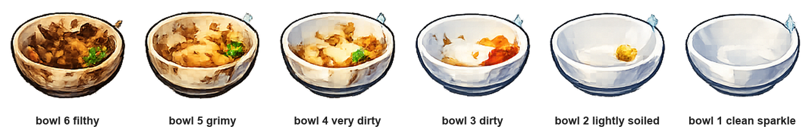

## Scrub the dish

Make the player add soap, then scrub through the bowl's dirty-to-clean costumes.

> [!TASK]
>
> The bowl has six costumes, from filthy to sparkling clean.
>
> 

> [!TASK]
>
> Add this script to the `bowl_state_01_clean_sparkle` sprite.
>
> ```blocks3
> +when this sprite clicked
> +if <(clean) = [false]> then
> +if <(soap) = [true]> then
> +repeat until <(costume [number v]) = (6)>
> +wait until <mouse down?>
> +start sound (pick random (1) to (4))
> +next costume
> +wait (0.2) seconds
> end
> +set [clean v] to [true]
> else
> +say [You need soap!] for (2) seconds
> +start sound (Collect v)
> end
> end
> ```

> [!TIP]
>
> The `repeat until`{:class="block3control"} loop stops when the bowl reaches costume `6`, the clean sparkling costume.

Click the green flag, then click the bowl before using the soap. It tells you what it needs. Click the soap, then click and hold on the bowl to scrub it clean.
