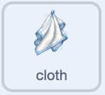
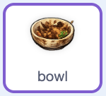

## Put it in the rack

Once the bowl is clean, let the player drag it into the rack and score a clean plate.

> [!TASK]
>
> Select the `cloth` sprite in the Sprite pane. Add a script that tells the player what to do when the bowl is clean.
>
> 
>
> ```blocks3
> +when I receive (clean v)
> +say [Now put it in the rack!] for (2) seconds
> ```
>
> **Check:** Clean the bowl. The cloth should tell you to put it in the rack.

> [!TASK]
>
> Select the `bowl` sprite in the Sprite pane. Start its clean-dish script: play a sound, remove the soap from the cloth, and make the bowl draggable.
>
> 
>
> ```blocks3
> +when I receive (clean v)
> +start sound (Coin v)
> +set [soap v] to [false]
> +set drag mode [draggable v]
> ```
>
> **Check:** Clean the bowl again. You should now be able to drag it.

> [!TASK]
>
> Continue the same script. Wait until the bowl touches the `rack` sprite, then shrink the bowl so it looks as though it has been put away.
>
> 
>
> ```blocks3
> when I receive (clean v)
> start sound (Coin v)
> set [soap v] to [false]
> set drag mode [draggable v]
> +wait until <touching (rack v)?>
> +repeat (60)
> +change size by (-2)
> end
> ```
>
> **Check:** Clean the bowl and drag it into the rack. It should shrink when it touches the rack.

> [!TASK]
>
> Add blocks to score the clean bowl, hide it, and reset it ready for another round.
>
> 
>
> ```blocks3
> when I receive (clean v)
> start sound (Coin v)
> set [soap v] to [false]
> set drag mode [draggable v]
> wait until <touching (rack v)?>
> repeat (60)
> change size by (-2)
> end
> +change [clean plates v] by (1)
> +hide
> +set size to (0) %
> +go to x: (0) y: (-140)
> +set [clean v] to [false]
> ```
>
> **Check:** Put the clean bowl in the rack. It should disappear and the `clean plates`{:class="block3variables"} score should increase.

> [!TASK]
>
> At the bottom of the script, broadcast a random item from the `stuff`{:class="block3variables"} list. Using the list's length means this block will keep working after you add more dishes.
>
> 
>
> ```blocks3
> when I receive (clean v)
> start sound (Coin v)
> set [soap v] to [false]
> set drag mode [draggable v]
> wait until <touching (rack v)?>
> repeat (60)
> change size by (-2)
> end
> change [clean plates v] by (1)
> hide
> set size to (0) %
> go to x: (0) y: (-140)
> set [clean v] to [false]
> +broadcast (item (pick random (1) to (length of [stuff v])) of [stuff v])
> ```

> [!TASK]
>
> Click the green flag. Use the soap, scrub the bowl, then drag it into the rack. The score should increase and a new dirty bowl should rise from the sink.
>
> 
