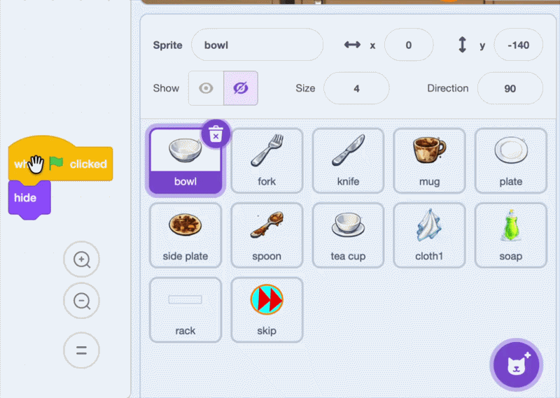

## Add the other dishes

Add every dish to the random selection, then copy the completed bowl scripts to the other dish sprites.

> [!TIP]
>
> Game developers often build and test one working **prototype** first. Fixing the bowl before copying its scripts makes problems easier to find.

> [!TASK]
>
> Select the Stage and open the `Variables`{:class="block3variables"} blocks menu. Tick the checkbox next to `stuff`{:class="block3variables"} so that you can see the list on the Stage.
>
> 
>
> Use the plus button on the list to add these seven message names, one item on each line:
>
> 2. `fork`
> 3. `knife`
> 4. `mug`
> 5. `plate`
> 6. `side plate`
> 7. `spoon`
> 8. `tea cup`
>
> 
>
> Untick the checkbox next to `stuff`{:class="block3variables"} again so that the list does not appear on the Stage.
>
> 

> [!TASK]
>
> Drag each of the bowl's four scripts onto every other dish sprite in the Sprite pane:
>
> - `fork`
> - `knife`
> - `mug`
> - `plate`
> - `side plate`
> - `spoon`
> - `tea cup`
>
> 

> [!TASK]
>
> Select each copied sprite in the Sprite pane. In the script that makes the dirty dish appear, change `when I receive (bowl)`{:class="block3events"} to the matching message from the table. Choose **New message** to create each message the first time you need it.
>
> 
>
> | Sprite | Receive message |
> | --- | --- |
> | `fork` | `fork` |
> | `knife` | `knife` |
> | `mug` | `mug` |
> | `plate` | `plate` |
> | `side plate` | `side plate` |
> | `spoon` | `spoon` |
> | `tea cup` | `tea cup` |
>
> Leave the first `switch costume to ()`{:class="block3looks"} block set to costume number `1`. Costume `1` is the filthy costume on every dish sprite, so this block is identical in every copied script.

> [!TASK]
>
> Click the green flag and play several rounds. Check that different dirty dishes appear and that every dish starts on costume `1`, can be scrubbed clean, and increases the score when it reaches the rack.
>
> 

> [!TIP]
>
> The random broadcast uses `length of [stuff]`{:class="block3variables"}, so it can choose from all eight list items without you changing the random-number range.
