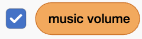

## Add music controls

Add background music, a volume slider, and a button that skips to the next song.

### Play music

> [!TASK]
>
> Select the Stage, then make these variables **for all sprites** from the `Variables`{:class="block3variables"} blocks menu:
>
> - `song`{:class="block3variables"} — this stores which song is playing. **Untick this variable.**
> - `music volume`{:class="block3variables"} — this stores how loud the music should be. Leave this variable ticked so it appears on the Stage. 
>
> <p align="center"></p>

> [!TASK]
>
> Keep the Stage selected. Add the music setup blocks near the start of its `when green flag clicked`{:class="block3events"} script, before the random dish broadcast.
>
> In the `broadcast ()`{:class="block3events"} block, choose **New message** and create a broadcast called `play music`.
>
> 
>
> ```blocks3
> when green flag clicked
> set [clean plates v] to (0)
> set [clean v] to [false]
> set [soap v] to [false]
> +set [song v] to (pick random (1) to (3))
> +set [music volume v] to (25)
> +broadcast (play music v)
> broadcast (item (pick random (1) to (length of [stuff v])) of [stuff v])
> ```

> [!TASK]
>
> Start another script on the Stage with a `when I receive ()`{:class="block3events"} block, and choose the `play music` message. Add an empty `forever`{:class="block3control"} loop.
>
> 
>
> ```blocks3
> +when I receive (play music v)
> +forever
> end
> ```

> [!TASK]
>
> At the top of the `forever`{:class="block3control"} loop, check whether the song number is greater than `3`. If it is, reset `song`{:class="block3variables"} to `1` so that the music starts again from the first song.
>
> 
>
> ```blocks3
> when I receive (play music v)
> forever
> +if <(song) > (3)> then
> +set [song v] to (1)
> end
> end
> ```

> [!TIP]
>
> A **rollover check** looks for a number that has gone past the last option and sends it back to the start. Here, a song number greater than `3` rolls over to `1`.

> [!TASK]
>
> Beneath that check, add an `if () then else`{:class="block3control"} block. Check whether `song`{:class="block3variables"} is `1`. Leave both branches empty for now.
>
> 
>
> ```blocks3
> when I receive (play music v)
> forever
> if <(song) > (3)> then
> set [song v] to (1)
> end
> +if <(song) = (1)> then
> else
> end
> end
> ```

> [!TASK]
>
> In the first branch, add a block that plays `song1` until it finishes.
>
> 
>
> ```blocks3
> when I receive (play music v)
> forever
> if <(song) > (3)> then
> set [song v] to (1)
> end
> if <(song) = (1)> then
> +play sound (song1 v) until done
> else
> end
> end
> ```

> [!TASK]
>
> Inside the first `else`{:class="block3control"} branch, add another `if () then else`{:class="block3control"} block. Check whether `song`{:class="block3variables"} is `2`. Leave both new branches empty for now.
>
> 
>
> ```blocks3
> when I receive (play music v)
> forever
> if <(song) > (3)> then
> set [song v] to (1)
> end
> if <(song) = (1)> then
> play sound (song1 v) until done
> else
> +if <(song) = (2)> then
> else
> end
> end
> end
> ```

> [!TASK]
>
> In the `song = 2` branch, add a block that plays `song2` until it finishes.
>
> 
>
> ```blocks3
> when I receive (play music v)
> forever
> if <(song) > (3)> then
> set [song v] to (1)
> end
> if <(song) = (1)> then
> play sound (song1 v) until done
> else
> if <(song) = (2)> then
> +play sound (song2 v) until done
> else
> end
> end
> end
> ```

> [!TASK]
>
> In the final `else`{:class="block3control"} branch, add a block that plays `song3` until it finishes.
>
> 
>
> ```blocks3
> when I receive (play music v)
> forever
> if <(song) > (3)> then
> set [song v] to (1)
> end
> if <(song) = (1)> then
> play sound (song1 v) until done
> else
> if <(song) = (2)> then
> play sound (song2 v) until done
> else
> +play sound (song3 v) until done
> end
> end
> end
> ```

> [!TASK]
>
> At the bottom of the `forever`{:class="block3control"} loop, add a `change () by ()`{:class="block3variables"} block. This moves to the next song after one finishes.
>
> 
>
> ```blocks3
> when I receive (play music v)
> forever
> if <(song) > (3)> then
> set [song v] to (1)
> end
> if <(song) = (1)> then
> play sound (song1 v) until done
> else
> if <(song) = (2)> then
> play sound (song2 v) until done
> else
> play sound (song3 v) until done
> end
> end
> +change [song v] by (1)
> end
> ```

### Control the music

> [!TASK]
>
> On the Stage, double-click the `music volume`{:class="block3variables"} variable display until it changes into a slider, then move it to the bottom corner of the stage. The player will be able to drag the slider to change the music volume.
>
> <p align="center"></p>

> [!TASK]
>
> Keep the Stage selected. Add another script so its sound volume follows the `music volume`{:class="block3variables"} slider while the game runs.
>
> 
>
> ```blocks3
> +when green flag clicked
> +forever
> +set volume to (music volume) %
> end
> ```

> [!TIP]
>
> Balancing the volume of music and sound effects is called **audio mixing**. Quieter music leaves room for the cleaning and scoring sounds.

> [!TASK]
>
> Select the `skip` sprite in the Sprite pane. Add a script that prevents the player from dragging the button.
>
> 
>
> ```blocks3
> +when green flag clicked
> +set drag mode [not draggable v]
> ```

> [!TASK]
>
> Keep the `skip` sprite selected. Add another script that broadcasts the `skip` message when the player clicks the button on the Stage.
>
> 
>
> ```blocks3
> +when this sprite clicked
> +broadcast (skip v)
> ```

> [!TASK]
>
> Select the Stage. Add a script for the `skip` message that stops the current song.
>
> 
>
> ```blocks3
> +when I receive (skip v)
> +stop all sounds
> ```
>
> Stopping the sound lets the music loop continue to its `change song by 1`{:class="block3variables"} block. The volume-control script keeps running, and the check at the beginning of the music loop resets any song number greater than `3`.

> [!TASK]
>
> Click the green flag and clean some dishes. Drag the volume slider and check that the music gets quieter or louder. Click the skip button on the Stage and check that the song changes.
>
> <p align="center"></p>

> [!SAVE]
