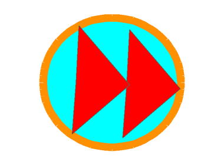

## Add music controls

Add background music and a button that skips to the next song.

> [!TASK]
>
> Click the `Stage`, then make these variables **for all sprites** from the `Variables`{:class="block3variables"} blocks menu:
>
> - `song`{:class="block3variables"} stores which song is playing.
> - `music volume`{:class="block3variables"} stores how loud the music should be.
>
> Untick both variables so they do not appear on the Stage.

> [!TASK]
>
> Click the `Stage`. Add the music setup blocks near the start of the `when green flag clicked`{:class="block3events"} script.
>
> ```blocks3
> when green flag clicked
> set [clean plates v] to (0)
> set [clean v] to [false]
> set [soap v] to [false]
> +set [song v] to (pick random (1) to (3))
> +set [music volume v] to (25)
> +set volume to (music volume) %
> broadcast (item (pick random (1) to (8)) of [stuff v])
> ```

> [!TIP]
>
> Balancing the volume of music and sound effects is called **audio mixing**. Quieter music leaves room for the cleaning and scoring sounds.

> [!TASK]
>
> Add a `forever`{:class="block3control"} loop to the bottom of the same script.
>
> ```blocks3
> when green flag clicked
> set [clean plates v] to (0)
> set [clean v] to [false]
> set [soap v] to [false]
> set [song v] to (pick random (1) to (3))
> set [music volume v] to (25)
> set volume to (music volume) %
> broadcast (item (pick random (1) to (8)) of [stuff v])
> +forever
> +if <(song) = (1)> then
> +play sound (song1 v) until done
> else
> +if <(song) = (2)> then
> +play sound (song2 v) until done
> else
> +play sound (song3 v) until done
> end
> end
> +change [song v] by (1)
> +if <(song) > (3)> then
> +set [song v] to (1)
> end
> end
> ```

> [!TASK]
>
> Click the `Sprite1` button sprite. Add a `broadcast ()`{:class="block3events"} block and choose the `skip` message. Set its drag mode to `not draggable`{:class="block3sensing"}.
>
> <p align="center"></p>
>
> ```blocks3
> +when this sprite clicked
> +broadcast (skip v)
> ```
>
> ```blocks3
> +when green flag clicked
> +set drag mode [not draggable v]
> ```

> [!TASK]
>
> Click the `Stage`. Add a `when I receive ()`{:class="block3events"} script for the `skip` message to play the next song.
>
> ```blocks3
> +when I receive (skip v)
> +stop [other scripts in sprite v]
> +stop all sounds
> +change [song v] by (1)
> +if <(song) > (3)> then
> +set [song v] to (1)
> end
> +forever
> +if <(song) = (1)> then
> +play sound (song1 v) until done
> else
> +if <(song) = (2)> then
> +play sound (song2 v) until done
> else
> +play sound (song3 v) until done
> end
> end
> +change [song v] by (1)
> +if <(song) > (3)> then
> +set [song v] to (1)
> end
> end
> ```

Click the green flag and clean dishes. The music plays, and the skip button changes the song.

> [!SAVE]
